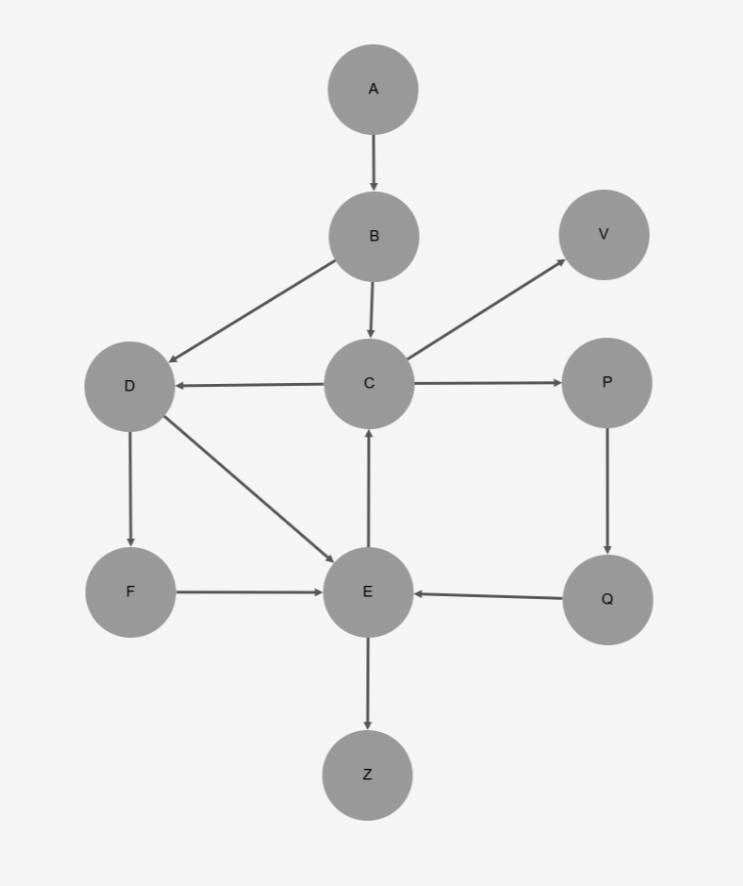
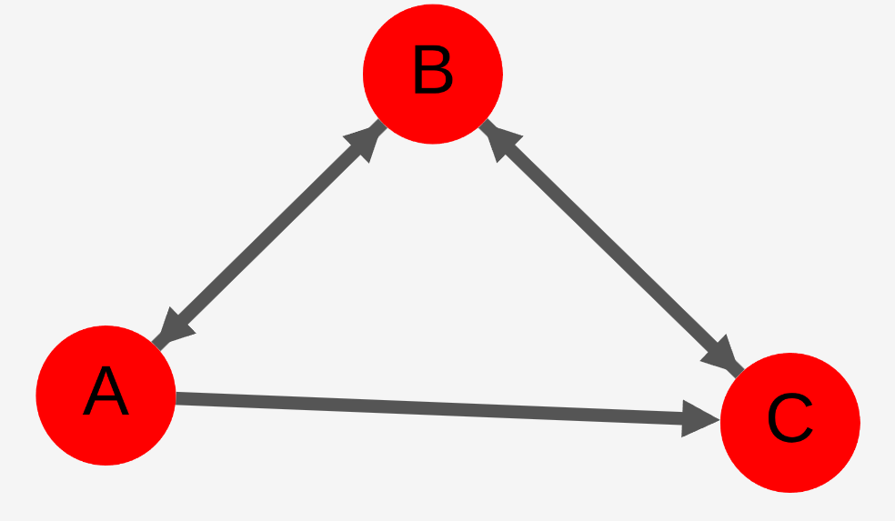

# A typescript program to find loops in a directed graph and investigate algorithms for optimization

See the function setup() to choose a test set

```typescript

window.onload = () => {
    setup(set2);
    setupEventhandlers();
    findLoops();
    updateStats();
}

```

Three test sets are available:

Test set 1:




Test set 2:




Test set 3 (related to Tarjan's worst case situation)


